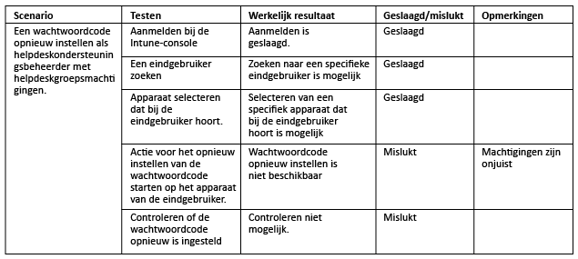
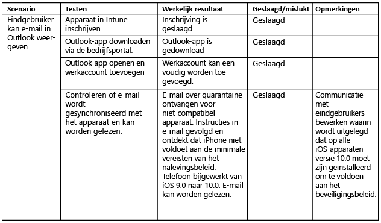

# Intune testen en valideren

[!INCLUDE[note for both-portals](../includes/note-for-both-portals.md)]

De testfase moet plaatsvinden tijdens en na de implementatiefase. U moet testaccounts, groepen en apparaten hebben voor het testen van alle vereiste IT (beheer)-scenario's en use-casescenario's die eerder zijn vastgesteld.

Het is raadzaam uw team voor IT-ondersteuning/helpdesk te betrekken bij de testfase om ondersteuningsdocumentatie samen te stellen en om de medewerkers van het team vertrouwd te maken met de ondersteuning van het product. Als een onderdeel of scenario niet werkt op basis van de use cases, is het belangrijk om de noodzakelijke wijzigingen en de redenen daarvoor vast te leggen.

## Voordat u begint

Het is raadzaam het volgende vast te leggen:

-   **Testcriteria:** voor het identificeren van de te hanteren benchmarks.

-   **Ontwerponderdelen:** moeten in ten minste één testcriterium zijn opgenomen.

Als een ontwerponderdeel niet is opgenomen in ten minste één testcriterium voor een vereiste of scenario, moet u beslissen of het ontwerponderdeel wel of niet vereist is. Zorg er bovendien voor dat u over de volgende items beschikt:

-   **Accounts:** de accounts die bij het testen worden gebruikt, moeten testaccounts zijn die een licentie hebben voor EMS en Office 365 om alle use-casescenario's te testen.

-   **Apparaten:** de apparaten die in deze fase worden gebruikt, moeten testapparaten zijn die kunnen worden gewist of worden teruggezet naar de fabrieksinstellingen.

-   **Integratieonderdelen:** alle integratieonderdelen (Certificate Connector, Intune Service to Service Connector voor gehoste Exchange en Intune On-Premises Exchange Connector) moeten worden geïnstalleerd en geconfigureerd, indien nodig.

Er kunnen ontwerpwijzigingen nodig zijn om onvoorziene problemen het hoofd te bieden. Bovendien moeten alle ontwerpwijzigingen volledig worden gedocumenteerd met de reden voor elke wijziging. Hier volgt een voorbeeld van een mogelijke wijziging:

-   U komt erachter dat u niet voldoet aan de vereisten van de Network Device Enrollment Service (NDES) en u weet ook dat de VPN- en Wi-Fi-profielen kunnen worden geconfigureerd met een basiscertificeringsinstantie die voldoet aan dezelfde vereisten zonder een NDES-implementatie.

U kunt te maken krijgen met uitdagingen of problemen waarvoor technische hulp of gespecialiseerde probleemoplossing is vereist tijdens het testen en valideren. Het is raadzaam om naar hulp te zoeken via de kanalen van Microsoft-ondersteuning.

-   [Informatie over het verkrijgen van ondersteuning voor Intune](https://docs.microsoft.com/intune/troubleshoot/how-to-get-support-for-microsoft-intune)

-   [Algemene tips voor probleemoplossing voor Microsoft Intune](https://docs.microsoft.com/intune/troubleshoot/general-troubleshooting-tips-for-microsoft-intune).

-   [Informatie over het verkrijgen van ondersteuning voor Microsoft Intune.](https://docs.microsoft.com/intune/troubleshoot/how-to-get-support-for-microsoft-intune)

-   [Contact opnemen met telefonische ondersteuning voor Microsoft Intune](https://docs.microsoft.com/intune/troubleshoot/contact-assisted-phone-support-for-microsoft-intune)

## Functionele-validatietests

Functionele validatie bestaat uit het testen van elk onderdeel en elke configuratie om te bepalen of de werking ervan in orde is. In de onderstaande tabel ziet u een voorbeeld van een validatietest.

## Validatietest van use case

Validatietests van use cases moeten worden uitgevoerd om na te gaan of de scenario's volledig en functioneel zijn. Er zijn twee soorten use-casescenario's: voor de IT-beheerder en de eindgebruiker.

### IT-beheerder

Validatietests voor de IT-beheerder moeten worden uitgevoerd om te controleren of beheeracties die voor een apparaat of gebruiker worden uitgevoerd, goed werken. Hieronder ziet u een voorbeeld van een end-to-end validatiescenario voor IT-beheerders.

### Eindgebruiker

Validatietests voor de eindgebruiker moeten worden uitgevoerd om te controleren of de ervaring van de eindgebruiker voldoet aan de verwachtingen en op de juiste wijze in alle informatie naar de gebruiker wordt aangeboden. Het is belangrijk om te controleren of de ervaring van de eindgebruiker in orde is om te voorkomen dat de acceptatie achterblijft bij de verwachtingen en dat de helpdesk overspoeld wordt met vragen.

## Volgende stappen

Nu u de functionele en use-casescenario's van Intune hebt getest en gevalideerd voor een gebruiker, bent u klaar voor de productie-rollout van Intune. Raadpleeg [Aanvullende bronnen](additional-resources.md) voor meer informatie.

<!--HONumber=Dec16_HO5-->

