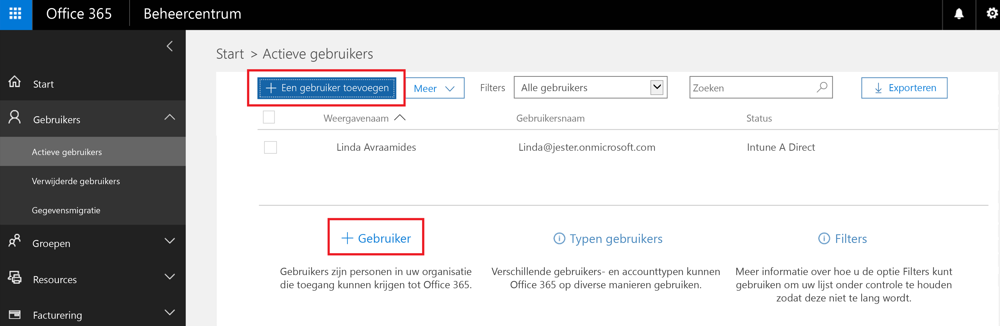
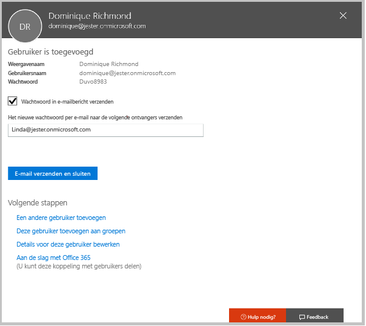
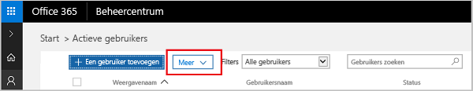
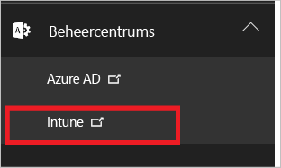
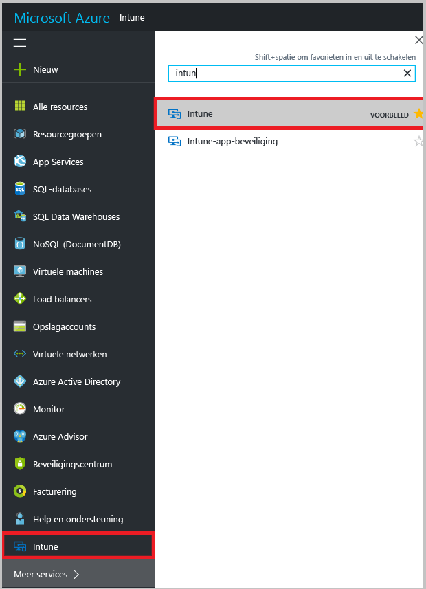

# Registreren voor een gratis proefversie van Microsoft Intune

[!INCLUDE[classic-portal](../includes/classic-portal.md)]

In dit artikel wordt uitgelegd hoe zich registreert voor een proefversie van Intune. Daarnaast voegt u enkele gebruikers aan uw proefversie toe zodat u de bijbehorende evaluatiehandleiding kunt volgen om te zien hoe mobiele apparaten met Intune worden beheerd. <!---or app data when devices are not enrolled in Intune.--->

>[!Note]
> Vanaf december 2016 wordt Microsoft Intune verplaatst naar de Azure-portal, waarbij sommige aanmeldingen voor gratis proefabonnementen in Intune in de Azure-portal worden geplaatst en sommige in de klassieke Intune-versie. Als uw proefabonnement in de Azure-portal is opgenomen, is de informatie in [inhoud van Intune Azure Preview](https://docs.microsoft.com/en-us/intune-azure/introduction/what-is-microsoft-intune) nuttiger voor u na voltooiing van de stappen in dit artikel.

## Aannames
In dit artikel over de aanmelding en in de evaluatiehandleiding wordt verondersteld dat u de evaluatieversie uitsluitend voor evaluatiedoeleinden gebruikt en u met een schone omgeving wilt beginnen wanneer u zich abonneert.

We zorgen ervoor dat u snel aan de slag kunt met de proefversie door een zeer eenvoudige omgeving in te stellen die alleen gebruikmaakt van Intune en ervan uitgaat dat dit de enige methode is waarmee u apparaten beheert (ook wel de instantie voor beheer van mobiele apparaten genoemd). De handleiding bevat echter ook verwijzingen naar diepere technische inhoud voor verdere exploratie.

De proefversie biedt dezelfde mogelijkheden als de abonnementsversie. Het enige verschil is dat de proefversie is beperkt tot maximaal 100 gebruikersaccounts.

## Aanmelden voor de proefversie
Ga naar de [registratiepagina voor Intune](https://portal.office.com/Signup/Signup.aspx?OfferId=40BE278A-DFD1-470a-9EF7-9F2596EA7FF9&dl=INTUNE_A&ali=1#0%20) en vul het formulier in om u aan te melden voor een proefabonnement.

Als u een werk- of schoolaccount hebt en dit wilt gebruiken voor de proefversie van Intune, volgt u [deze aanmeldingsinstructies](https://docs.microsoft.com/en-us/intune/get-started/start-with-a-paid-subscription-to-microsoft-intune-step-1). In dit artikel en de evaluatiehandleidingen wordt echter verondersteld dat u geen dergelijk account gebruikt.

> [!TIP]
> Als de landinstellingen voor de meeste IT-activiteiten en van de meeste gebruikers afwijkt van die van u, kunt u de desbetreffende landinstellingen configureren voor uw proef om de prestaties te testen.

### Overwegingen voor na uw registratie
Wanneer u zich registreert voor een proefversie, ontvangt u een e-mailbericht met gegevens over uw account op het e-mailadres dat u hebt opgegeven tijdens het registratieproces. In deze e-mail wordt bevestigd dat uw proefversie actief is.

Wanneer het registratieproces is voltooid, wordt u omgeleid naar een pagina waarop u gebruikers kunt toevoegen en licenties kunt toewijzen met behulp van het Office 365-beheercentrum. Wanneer u zich de volgende keer aanmeldt bij de **klassieke versie van Intune** (https://manage.microsoft.com), wordt u automatisch omgeleid naar de beheerconsole van Intune.

Als uw proefabonnement in de **Azure-portal** is opgenomen, gaat u naar https://portal.azure.com en meldt u zich aan met de referenties van uw Intune-proefabonnement.

## Gebruikers toevoegen
Voordat u het Office 365-beheercentrum verlaat om terug te keren naar Intune, moet u enkele gebruikers toevoegen aan uw proefaccount.

In het Office 365-beheercentrum kunt u gebruikers afzonderlijk of in bulk toevoegen door een CSV-bestand te uploaden. Voor uw proefaccount doen we beide. U wilt in uw productieomgeving echter waarschijnlijk ook profiteren van uw Azure Active Directory-gebruikersaccounts. Meer informatie hierover vindt u in de [Introductiehandleiding](https://docs.microsoft.com/en-us/intune/get-started/start-with-a-paid-subscription-to-microsoft-intune-step-3) en in de sectie [Volgende stappen](#Next-steps) in dit artikel.

### Een afzonderlijke gebruiker toevoegen
1. Kies een van de opties voor het toevoegen van een gebruiken om een formulier te openen waarmee u een gebruiker kunt maken. Alleen de items die zijn gemarkeerd met een asterisk (\*) zijn verplicht.

2.  Wanneer u de gebruiker toevoegt, wordt er als laatste stap e-mailbericht met het tijdelijke wachtwoord voor Intune verzonden. In het kader van deze evaluatie gebruikt u uw eigen zakelijke e-mailadres, zodat u de aanmeldingsgegevens ontvangt en de e-mail krijgt te zien die uw gebruikers ontvangen. Vervolgens kunt u deze gebruikersidentiteiten gebruiken om de testapparaten te registreren. 

 

3. Als u een beheerdersrol aan een gebruiker wilt toewijzen nadat u deze hebt gemaakt, kunt u de rol bewerken in het Office 365-beheercentrum door de gebruikersnaam in uw lijst met gebruikers te selecteren en vervolgens in de regel Rol de optie **Bewerken** te selecteren om de lijst met gebruikersrollen weer te geven die u kunt selecteren en aan de betreffende gebruiker kunt toewijzen.

 

### Meerdere gebruikers importeren
1. U vindt de wizard voor het importeren van meerdere gebruikers in de lijst **Meer**.

 

2. Voor de correcte configuratie van uw CSV-bestand kunt u een sjabloonbestand downloaden waarin u uw gebruikersgegevens kunt invullen. Download het CSV-bestand dat kopteksten en gegevens over voorbeeldgebruikers bevat om te zien wat voor gegevens er precies nodig zijn voor elk veld.

 

3. Nadat u het CSV-bestand hebt gemaakt en opgeslagen, kiest u **Bladeren** om het bestand te selecteren. Controleer het bestand en kies **Volgende**. Uw gebruikers worden geüpload en toegevoegd aan uw lijst met actieve gebruikers.

> [!NOTE]
> Uw gebruikers worden pas in Intune weergegeven nadat ze een apparaat hebben geregistreerd dat moet worden beheerd.

Het is nu tijd om naar Intune te gaan en te beginnen met het beheren van uw gebruikers, hun apparaten en hun apps.

## Zorg voor een juiste werkwijze voor beheer
### Klassieke versie van Intune
Er zijn twee portals die u voor de klassieke versie van Intune kunt gebruiken:
- Het Office 365-beheercentrum ([portal.office.com](https://portal.office.com))
- De beheerconsole van Intune ([manage.microsoft.com](https://manage.microsoft.com))

Normaal gesproken voert u uw werkzaamheden uit in de Intune-beheerconsole, zoals hieronder. Dit is de site waar u uw groepen, beleid, apparaten en apps instelt en beheert.

U gebruikt het Office 365-beheercentrum (zie hieronder) echter om gebruikers en andere aspecten van uw account toe te voegen en te beheren, met inbegrip van de facturering en ondersteuning.

U kunt van het Office 365-beheercentrum naar de Intune-beheerconsole navigeren. De beheercentra bevinden zich onder het laatste item in het linker navigatiedeelvenster. Kies **Intune** om de Intune-beheerconsole te openen in een nieuw tabblad.

Als van Intune terug wilt keren naar het Office 365-beheercentrum, kiest u op de pagina Overzicht groepen de taak **Gebruikers toevoegen**.

### Intune Azure Preview
Er zijn drie portals die u kunt gebruik voor Intune Azure Preview:
- Het Office 365-beheercentrum ([portal.office.com](https://portal.office.com))
- Het Intune-dashboard in Azure ([portal.azure.com](https://portal.azure.com))
- De klassieke beheerconsole van Intune ([manage.microsoft.com](https://manage.microsoft.com))

De eerste keer dat u zich bij Intune in Azure aanmeldt, wordt Intune nog niet weergegeven in het Azure-dashboard. De Intune-service aan uw Azure-dashboard toevoegen:
1. Kies **Meer services >** in de lijst met Azure-services links van het dashboard en voer Intune in het zoekvak in.
2. Kies **Intune** uit de lijst en selecteer de ster om de service toe te voegen aan de lijst met services.  
3. Kies **Intune** in de lijst met services om het Intune-dashboard te openen.

Doorgaans voert u uw werkzaamheden uit in het Intune-dashboard, dat hieronder wordt weergegeven. Dit is de site waar u uw groepen, beleid, apparaten en apps instelt en beheert. U kunt vanuit het dashboard naar de klassieke Intune-beheerconsole gaan door de tegel **Klassieke Intune-portal openen** te kiezen. Voer https://portal.azure.com in de adresbalk van uw browser in om terug te keren naar Intune Azure Preview en kies nogmaals **Intune** in de lijst met services.

 

U gebruikt het Office 365-beheercentrum (zie hieronder) echter om gebruikers en andere aspecten van uw account toe te voegen en te beheren, met inbegrip van de facturering en ondersteuning.

Als u van het Office 365-beheercentrum naar het Intune-dashboard wilt gaan, voert u https://portal.azure.com in de adresbalk van uw browser in. Kies **Intune** in de lijst met services.

U vanuit Intune wilt terugkeren naar het Office 365-beheercentrum, voert u https://portal.office.com in de adresbalk van uw browser in. Als u al bent aangemeld bij Intune, gaat u rechtstreeks naar het Office 365-beheercentrum.

## Volgende stappen
### Klassieke versie van Intune
Evaluatiescenario: [Mobile Device Management evalueren in Microsoft Intune](mobile-device-management-trial-guide-microsoft-intune.md)

### Intune Azure Preview
Meer informatie over [Intune in Azure Preview Portal](https://docs.microsoft.com/en-us/intune-azure/introduction/what-is-microsoft-intune)

### Integratie met andere producten
Meer informatie over het gebruik van uw Azure Active Directory-gebruikersaccounts met Intune:
- [Identiteitsvereisten](https://docs.microsoft.com/en-us/active-directory/active-directory-hybrid-identity-design-considerations-overview#design-considerations-overview)
- [Adreslijstsynchronisatie](https://docs.microsoft.com/en-us/active-directory/active-directory-hybrid-identity-design-considerations-directory-sync-requirements)
- [Vereisten voor Multi-factor Authentication](https://docs.microsoft.com/en-us/active-directory/active-directory-hybrid-identity-design-considerations-multifactor-auth-requirements)

Meer informatie over het gebruik van [Intune met System Center Configuration Manager](https://docs.microsoft.com/en-us/sccm/mdm/understand/hybrid-mobile-device-management)

<!--HONumber=Dec16_HO3-->

