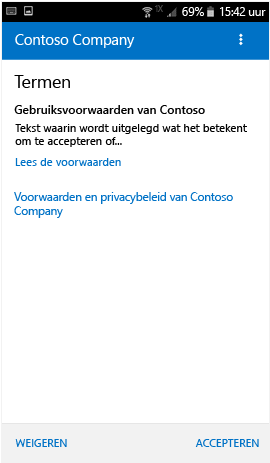

# Uw apparaat inschrijven bij de bedrijfsportal  
Schrijf uw persoonlijke of zakelijke Android-apparaat in voor veilige toegang tot uw zakelijke e-mail, apps en gegevens. De bedrijfsportal biedt ondersteuning voor Android-apparaten, inclusief Samsung Knox, met Android 4.4 en hoger.  
 
> [!VIDEO https://www.youtube.com/embed/k0Q_sGLSx6o?rel=0]

> [!NOTE]
> Samsung Knox is een beveiligingstype dat door sommige Samsung-apparaten wordt gebruikt als extra bescherming naast de beveiligingsfuncties van systeemeigen Android-apparaten. Als u wilt controleren of u een Samsung Knox-apparaat hebt, gaat u naar **Instellingen** > **Over apparaat**. Als de **Knox-versie** niet wordt vermeld, hebt u een systeemeigen Android-apparaat.

## Een apparaat inschrijven  
Zorg ervoor dat u [de gratis app Intune-bedrijfsportal via Google Play hebt geïnstalleerd](https://play.google.com/store/apps/details?id=com.microsoft.windowsintune.companyportal). 

Tijdens de registratie wordt u mogelijk gevraagd om een categorie te kiezen die het beste beschrijft hoe u uw apparaat gebruikt. Het ondersteuningsteam van het bedrijf gebruikt uw antwoord om te controleren tot welke apps u toegang hebt.  

1. Open de app Bedrijfsportal.  

3. Tik in het **aanmeldingsscherm** van de bedrijfsportal op **Aanmelden** en meld u vervolgens aan met uw werk- of schoolaccount.

      

4. Als u wordt gevraagd de algemene voorwaarden van uw organisatie te accepteren, tikt u op **ACCEPT**. Dit scherm wijkt mogelijk enigszins af van het onderstaande schermopnamevoorbeeld. 

   

5. Meld u aan bij de bedrijfsportal-app met uw werk- of schoolaccount en wachtwoord, en tik vervolgens op **Aanmelden**.

   

6. Tik in het scherm **Instellen van bedrijfstoegang** op **DOORGAAN**.

   

   > [!NOTE]
   > De gele driehoeken betekenen niet dat er al een fout is opgetreden. Deze pictogrammen geven aan dat er nog stappen moeten worden voltooid in het inschrijvingsproces.

7. Bekijk een lijst met zaken die het ondersteuningsteam van het bedrijf wel en niet kan zien op het apparaat en tik op **DOORGAAN**.

   

8. Lees op het scherm **De volgende stap** wat er gebeurt tijdens het registreren en tik vervolgens op **REGISTREREN**.

   

9. Als u Android 6.0 of hoger gebruikt, moet u deze stap uitvoeren. Ga anders naar de volgende stap.

   Als het ondersteuningsteam van het bedrijf bepaald beleid heeft ingesteld, ziet u mogelijk de volgende berichten:
   - **De bedrijfsportal toestaan telefoongesprekken uit te voeren en te beheren?**

     

   Als u dit bericht ziet, tikt u op **TOESTAAN**. Het is veilig om op TOESTAAN te tikken, omdat **Microsoft nooit telefoongesprekken uitvoert of beheert**. Google beheert de tekst van het bericht. De tekst kan niet worden gewijzigd door Microsoft. Als u toegang toestaat, staat u alleen toe dat het IMEI-nummer ( International Mobile Equipment Identity) van uw apparaat wordt verzonden naar Intune. Het IMEI-nummer is vergelijkbaar met een serienummer en is uniek voor een mobiel apparaat.

   Als u de toegang weigert, wordt het bericht nogmaals weergegeven tijdens de volgende keer dat u zich aanmeldt bij de bedrijfsportal. Als u toekomstige berichten wilt uitschakelen, selecteert u **Niet opnieuw vragen**. Als u besluit om alsnog toegang te verlenen, gaat u naar **Instellingen** > **Apps** > **Bedrijfsportal** > **Machtigingen** > **Telefoon** en schakelt u de machtiging in.  

   - **Toestaan dat Bedrijfsportal toegang heeft tot uw contactpersonen?**

     

     Als u dit bericht ziet, tikt u op **TOESTAAN**. Het is veilig om op TOESTAAN te tikken, omdat **Microsoft nooit toegang tot uw contactpersonen probeert te krijgen**. Google beheert de tekst van het bericht. De tekst kan niet worden gewijzigd door Microsoft. Als u toegang toestaat, kan alleen met de bedrijfsportal-app uw werkaccount worden gemaakt, gebruikt en beheerd.

     Als u de toegang weigert, wordt het bericht de volgende keer dat u zich bij de bedrijfsportal aanmeldt, opnieuw weergegeven. U kunt echter toekomstige berichten uitschakelen door op het selectievakje **Niet opnieuw vragen** te tikken. Als u later besluit toegang te verlenen, gaat u naar **Instellingen** &gt; **Apps** &gt; **Bedrijfsportal** &gt; **Machtigingen** &gt; **Telefoon** en schakelt u de machtiging in.

10. Tik op het scherm **Apparaatbeheerder activeren** op **Activeren**.

    

    De rol van apparaatbeheerder houdt in dat de bedrijfsportal uw apparaat moet beheren. Het stelt uw beheerder in staat om bepaalde dingen te bekijken, zoals het aantal keren dat u uw scherm hebt ontgrendeld en bepaalde acties hebt ondernomen.    

    Microsoft heeft geen zeggenschap over dit bericht en de bewoording kan enigszins drastisch overkomen. Met de bedrijfsportal kunnen niet alleen de beperkingen en toegang worden weergegeven die relevant zijn voor uw organisatie. Deze worden alle tegelijk op dit scherm weergegeven. Neem aan de hand van de contactgegevens op de [website van de bedrijfsportal](https://go.microsoft.com/fwlink/?linkid=2010980) contact op met het ondersteuningsteam van het bedrijf als u vragen hebt met betrekking tot uw eigen organisatie.  

11. Volg de aanwijzingen voor het invoeren van de pincode of het wachtwoord. Als u al een pincode of wachtwoord op dit apparaat hebt ingesteld, wordt dit scherm niet weergegeven of wordt u niet verzocht om een nieuwe pincode of nieuw wachtwoord in te voeren.  

    

12. Als u een Samsung Knox-apparaat gebruikt, tikt u op **Bevestigen**. U ziet dan een bericht dat uw apparaat wordt geregistreerd. Als u een systeemeigen Android-apparaat gebruikt, let dan op het volgende scherm waarin wordt weergegeven dat het apparaat wordt geregistreerd.

    

    Op dit scherm wordt aangegeven dat uw apparaat wordt geregistreerd.

    

13. Wanneer het scherm **Instellen van bedrijfstoegang** wordt weergegeven, tikt u op **DOORGAAN**. Als er een bericht verschijnt waarin wordt aangegeven dat het apparaat niet voldoet aan het beleid, volgt u de instructies om het probleem te verhelpen en tikt u vervolgens op **DOORGAAN**.

    

    

    Als u op de problemen tikt, wordt meer informatie over het betreffende probleem weergegeven.

    

      

14. Tik in het scherm **Instellen van bedrijfstoegang is voltooid** op **GEREED**. Uw apparaat is nu geregistreerd.

    

## Volgende stappen  

Ga naar **Instellingen** > **Beveiliging** en schakel **Onbekende bronnen** in voordat u bedrijfsapps installeert. Als u deze optie niet inschakelt voordat u apps installeert, wordt het volgende bericht weergegeven: "Installatie geblokkeerd. Uw apparaat is uit veiligheidsoverwegingen zo ingesteld dat installaties van apps die afkomstig zijn van onbekende bronnen, worden geblokkeerd." U kunt in het foutberichtvenster op **Instellingen** tikken om naar de optie **Onbekende bronnen** te gaan.  

> [!Note]
> Als uw organisatie gebruikmaakt van Telecom Expense Management-software, zijn er een aantal aanvullende stappen die u moet doorlopen om uw apparaat volledig in te schrijven. Zie [hier](enroll-your-device-with-telecom-expense-management-android.md) voor meer informatie.

Als er een fout optreedt bij het registreren van uw apparaat bij Intune, kunt u [een e-mailbericht naar het ondersteuningsteam van uw bedrijf verzenden](send-logs-to-your-it-admin-by-email-android.md).  

Nog hulp nodig? Neem contact op met het ondersteuningsteam van het bedrijf (zie de [bedrijfsportalwebsite](https://go.microsoft.com/fwlink/?linkid=2010980) voor contactgegevens) of stuur een e-mail naar het <a href="mailto:wintunedroidfbk@microsoft.com?subject=I'm having trouble with enrolling my Android device&body=Describe the issue you're experiencing here.">Microsoft Android-team</a>.
