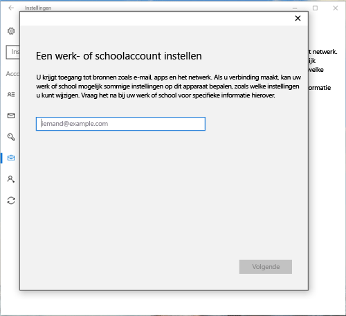

# Uw Windows 10-apparaat inschrijven bij Intune

> [!NOTE]
> Windows 10 werkt voor alle typen apparaten. Of u nu een desktop, een telefoon of een tablet gebruikt, de te volgen stappen zijn dezelfde, ook al zien ze er iets anders uit dan de afbeeldingen op deze pagina.

> [!VIDEO https://channel9.msdn.com/Series/IntuneEnrollment/Windows-Enrollment/player]

1. Ga naar **Start**.

  - Ga op een **Windows 10 Desktop**-apparaat naar het **startmenu**.
  - Ga op een **mobiel Windows 10-apparaat** naar het **startscherm** en swipe naar de lijst **Alle apps**.

2.  Open de app **Instellingen** door in het zoekvak te zoeken op 'instellingen'.

3. Selecteer **Accounts** > **Toegang werk of school** > **Verbinden**.

    

3.  Geef uw e-mailadres van werk of school op en selecteer vervolgens **Volgende**.

    

4. Meld u bij Intune aan met uw werk- of schoolaccount.

    

    U ziet een bericht waarin staat dat bij uw bedrijf of school uw apparaat wordt geregistreerd.

5. Wanneer u het scherm **U bent klaar** ziet, selecteert u **sluiten**. U bent klaar.

  

6. Als u wilt controleren of uw verbinding wel klopt, gaat u terug naar **Instellingen**. Hier wordt uw werk- of schoolaccount vermeld.

    

Als u de voorgaande stappen hebt uitgevoerd, maar nog steeds geen toegang hebt tot uw werk- of schoolaccount en -bestanden, volgt u de stappen in [Probleemoplossingsstappen als u Werk of school openen ziet](troubleshoot-your-windows-10-device-windows.md#troubleshooting-steps-to-follow-if-you-see-access-work-or-school).
