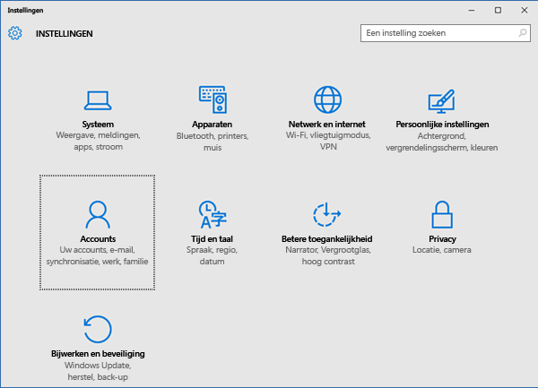
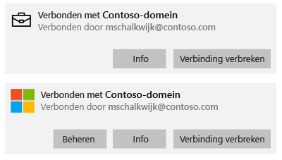
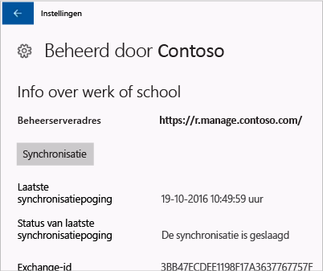
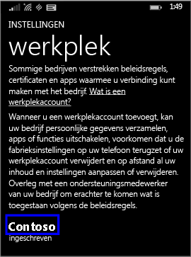

# Uw Windows-apparaat handmatig synchroniseren

Soms kan het installeren van een app op een Windows-apparaat langer duren dan u denkt. In dat geval kunt u proberen het Windows-apparaat handmatig te synchroniseren. Synchronisatie kan bijdragen aan een snellere installatie.

> [!Note]
> De installatie van apps kan wat langer duren in een trager netwerk of als er grotere hoeveelheden apparaten op hetzelfde moment inhoud downloaden.

In de volgende versies van Windows kunt u handmatig synchroniseren. Als uw apparaat een andere versie van Windows gebruikt, kunt u helaas geen handmatige synchronisatie uitvoeren.

* [Synchroniseren met Windows 10 Desktop](#windows-10-desktop)
* [Synchroniseren met Windows 10 Mobile](#windows-10-mobile)
* [Synchroniseren met Windows Phone 8.1](#windows-phone-81)

## Windows 10 Desktop
Omdat er meer dan één versie van Windows 10 is, zijn er twee sets met stappen. Bekijk de schermafbeeldingen om te zien welke stappen u het beste kunt gebruiken en volg dan de stappen die betrekking hebben op uw apparaat.

1. Kies de knop **Start** en kies vervolgens **Instellingen**.

    

2. Kies op de pagina **Instellingen** de optie **Accounts**.

    

3. Bekijk de volgende twee schermen en kies het scherm dat lijkt op het scherm op uw apparaat. Volg de stappen die bij het scherm horen dat u op het apparaat ziet.

    Als u dit scherm met de melding 'Toegang tot werk of school' ziet, volgt u de instructies in [Stappen om te volgen als u Toegang tot werk of school ziet](#steps-to-follow-if-you-see-access-work-or-school).

    

    Als u dit scherm met de melding 'Toegang via het werknetwerk' ziet, volgt u de stappen in [Stappen om te volgen als u Toegang via het werknetwerk ziet](#steps-to-follow-if-you-see-work-access).

    

### Stappen om te volgen als u Toegang tot werk of school ziet

1. Kies op de pagina **Accounts** de optie **Toegang tot werk of school**.

    

2. Kies uw werk- of schoolaccount. Afhankelijk van hoe het ondersteuningsteam van het bedrijf alles heeft ingesteld, ziet u mogelijk twee accounts die op het voorbeeld hieronder lijken. Naast het ene account wordt een aktetas weergegeven en naast het andere account ziet u het Microsoft-logo.

   - Als u het account met de aktetas ziet, selecteert u dat account en zoekt u naar een **Info**-knop daaronder.
   - Als u het account met het Microsoft-logo ziet, selecteert u dat account en zoekt u naar een **Info**-knop daaronder.

     

3. Kies de **Info**-knop. Er wordt een dialoogvenster geopend dat op het voorbeeld hieronder lijkt.

    

4. Kies de knop **Synchroniseren**. Het apparaat wordt gesynchroniseerd met Intune.

### Te volgen stappen als u Toegang via het werknetwerk ziet

1. Kies op de pagina **Accounts** de optie **Toegang via het werknetwerk**.

    

2. Kies in de sectie **Registreren voor apparaatbeheer** de naam van uw bedrijf.

    

3. Kies de knop **Synchroniseren**.

    

   De knop wordt uitgeschakeld totdat de synchronisatie is voltooid.

### Windows 10 Mobile
Ga als volgt te werk als u uw Windows 10 Mobile-apparaat handmatig wilt synchroniseren om een trage installatie van de app te versnellen:

   1. Ga naar **Alle apps** > **Instellingen** > **Accounts**.

       

   2. Kies **Toegang via het werknetwerk**.

       

   3. Kies onder **Registreren voor apparaatbeheer** de naam van uw bedrijf.

       

   4. Kies het pictogram **Synchroniseren**.

       

       Boven in het scherm wordt het bericht 'Uw account wordt gesynchroniseerd' weergegeven. De knop **Synchroniseren** is pas beschikbaar nadat de synchronisatie van het apparaat is voltooid.

## Windows Phone 8.1
Ga als volgt te werk als u uw Windows Phone 8.1-apparaat handmatig wilt synchroniseren om een trage installatie van de app te versnellen:

1. Ga naar **Alle apps** > **Instellingen** > **Werkplek**.

    

2. Kies de naam van uw bedrijf.

    

3. Kies het pictogram **Synchroniseren**.

    

   Boven in het scherm wordt het bericht 'Uw account wordt gesynchroniseerd' weergegeven tot het apparaat is gesynchroniseerd.

Nog hulp nodig? Neem contact op met het ondersteuningsteam van uw bedrijf. Controleer of de contactgegevens beschikbaar zijn op de [bedrijfsportalwebsite](https://portal.manage.microsoft.com#HelpDeskDialog).
