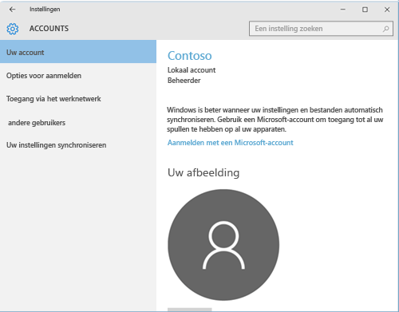

# Problemen met de registratie van uw Windows 10-apparaat oplossen
Als u de stappen in [Uw Windows 10 Mobile- of Windows 10-desktopapparaat registreren bij Intune](enroll-your-w10-phone-or-w10-pc-windows.md) hebt gevolgd, maar u nog steeds geen toegang hebt tot de e-mails en bestanden van uw werk- of schoolaccount, volgt u deze stappen voor probleemoplossing.

1.  Bekijk de volgende twee schermen en kies het scherm dat lijkt op het scherm op uw apparaat. Volg de stappen die bij het scherm horen dat u op het apparaat ziet.

    Als u dit scherm ziet, volgt u de stappen in [Probleemoplossingsstappen als u Werk of school openen ziet](#troubleshooting-steps-to-follow-if-you-see-access-work-or-school).

    

    Als u dit scherm ziet, volgt u de stappen in [Probleemoplossingsstappen als u Uw account ziet](#troubleshooting-steps-to-follow-if-you-see-your-account).

    

## Probleemoplossingsstappen als u Werk of school openen ziet

1. Als u bovenstaande stappen hebt uitgevoerd, maar nog steeds geen toegang hebt tot de e-mails of bestanden van uw werk- of schoolaccount, gaat u terug naar **Werk of school openen**.

2. Voer een van de volgende handelingen uit:

   - Als u een verbinding ziet die lijkt op die in de onderstaande afbeelding, tikt u erop. Controleer vervolgens of u de opties Beheren, Info en Verbinding verbreken ziet. Als deze opties worden weergegeven, bent u nu geregistreerde en verbonden.

     

   - Als u de bovenstaande verbindingsinformatie niet ziet, of u ziet deze wel maar er ontbreken opties, tikt u op **Verbinden** en meldt u zich aan met de referenties van uw werk- of schoolaccount. U bent nu verbonden.

## Probleemoplossingsstappen als u Uw account ziet

Als u bovenstaande stappen hebt uitgevoerd, maar nog steeds geen toegang hebt tot e-mail, bestanden en andere gegevens van uw werk of school, gaat u terug naar **Accounts** en tikt u op **Toegang via het werknetwerk**.

- Als u uw werk- of schoolaccount ziet, is het gelukt. U bent verbonden.

- Als u uw werk- of schoolaccount niet ziet, tikt u op **Verbinding maken** en meldt u zich aan met de referenties van uw werk- of schoolaccount.

## Probleemoplossingsstappen als u Werk- of schoolaccount instellen ziet

Als u een bericht ziet met de tekst <strong>Er is geen beheereindpunt automatisch gedetecteerd dat overeenkomt met de ingevoerde gebruikersnaam. Controleer de gebruikersnaam en probeer het opnieuw. Als u de URL naar het beheereindpunt kent, voert u deze in.</strong>, voert u vervolgens de gebruikersnaam en het wachtwoord opnieuw in. Als dit ook niet werkt, neemt u contact op met het ondersteuningsteam van het bedrijf van de website die u moet opgeven in het tekstvak <strong>Beheereindpunt</strong>. Deze website ziet er waarschijnlijk als volgt uit: <strong>www.yourcompany.onmicrosoft.com</strong>.

Nog hulp nodig? Neem contact op met het ondersteuningsteam van uw bedrijf. Controleer of de contactgegevens beschikbaar zijn op de [bedrijfsportalwebsite](https://portal.manage.microsoft.com#HelpDeskDialog).
