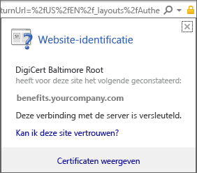

# Er ontbreekt een certificaat voor uw Android-apparaat dat is vereist door het ondersteuningsteam van uw bedrijf

Als uw apparaat niet bij Intune is geregistreerd en er een bepaald certificaat ontbreekt dat is vereist door het ondersteuningsteam van uw bedrijf, kunt u zich niet aanmelden bij de bedrijfsportal-app. Wanneer u zich probeert aan te melden, wordt het volgende bericht weergegeven:

Om dit probleem op te lossen en het vereiste certificaat op te halen, moeten er twee belangrijke stappen worden uitgevoerd:

- Het ontbrekende certificaat identificeren door te kijken op een bedrijfs- of school-pc.
- Het ontbrekende certificaat downloaden van internet met behulp van uw apparaat.

## Het ontbrekende certificaat identificeren door te kijken op een bedrijfs- of school-pc

1. Open Internet Explorer op een pc. Als u voor dit doel niet over een pc beschikt, neemt u contact op met het ondersteuningsteam van uw bedrijf. Ga naar de [bedrijfsportalwebsite](https://portal.manage.microsoft.com#HelpDeskDialog) voor de contactgegevens van het ondersteuningsteam van uw bedrijf.

2. Ga naar de [bedrijfsportalwebsite](https://portal.manage.microsoft.com#HelpDeskDialog) en meld u aan met de referenties van uw werk- of schoolaccount.

3. Rechts van de adresbalk van de browser kiest u het symbool dat lijkt op een hangslot, zoals hieronder is weergegeven.

    

    Als u het hangslot niet ziet, stopt u en neemt u contact op met het ondersteuningsteam van uw bedrijf. Het hangslot betekent dat u veilig bent aangemeld. Ga dus alleen verder als u dit symbool ziet.

4. Kies **Certificaten weergeven**.

    

5. Kies in het dialoogvenster **Certificaat** het tabblad **Certificaatpad** en identificeer vervolgens het certificaat dat u van internet moet ophalen. De naam van het certificaat dat u nodig hebt, bevindt zich op dezelfde positie als het gemarkeerde certificaat in het voorgaande voorbeeld.

## Het ontbrekende certificaat op uw mobiele Android-apparaat downloaden en installeren

1. Gebruik een zoekmachine zoals Bing of Google, en zoek op de naam van het ontbrekende certificaat dat u in het vorige gedeelte hebt geïdentificeerd. Het certificaat kan verschillende extensies hebben, zoals '.crt' of '.pem', enzovoort.

2. Download het basiscertificaat van de website.

3. Nadat het certificaat is gedownload, sleept u omlaag vanaf de bovenkant van uw apparaat om de meldingen te openen en vervolgens tikt u op de naam van het certificaat in de lijst met meldingen.

4. In het dialoogvenster **Benoem het certificaat** dat hieronder wordt weergegeven, accepteert u de standaardcertificaatnaam.

5. Zorg ervoor dat **Gebruik van referenties** is ingesteld op **Worden gebruikt voor VPN en apps** en tik op **OK**.

    

6. Sluit de bedrijfsportal-app.

7. Open de bedrijfsportal-app opnieuw. Nu moet u zich bij de bedrijfsportal-app kunnen aanmelden. Neem contact op met het ondersteuningsteam van uw bedrijf als u hulp nodig hebt.

Als u dezelfde melding over een 'ontbrekend certificaat' ziet als de melding die eerder werd weergegeven en u de procedure al hebt uitgevoerd, is er waarschijnlijk nog een ander certificaat dat door het ondersteuningsteam van uw bedrijf moet worden geïnstalleerd. Neem contact op met het ondersteuningsteam van uw bedrijf voor hulp bij het gebruik van de contactgegevens die beschikbaar zijn op de [bedrijfsportalwebsite](https://portal.manage.microsoft.com#HelpDeskDialog).
